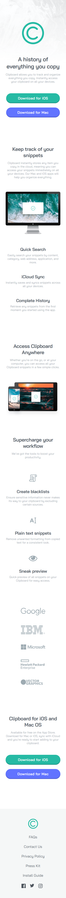
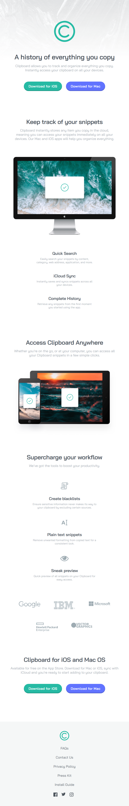
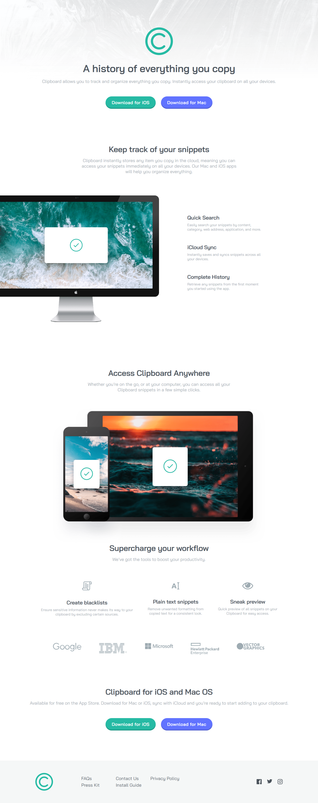

# Clipboard Landing Page 🚀

## Overview
This is a simple page for a "mock" company called Clipboard.

Built to be responsive depending on device size.

### Built With

🔴 Mobile First

🔴 Google Fonts

🔴 Semantic HTML

🔴 CSS Custom Properties

### Preview

  

    <b>Mobile Design:</b>
  

  

  

  

  

    <b>Tablet Design:</b>
  

  

    

  

  

    <b>Desktop Design:</b>
  

  

    

  

## Update Progress

### April 15th, 2026

Completed Desktop Query

Main changes to font size and padding

### April 14th, 2026

Completed Tablet Query

Main changes to font size and padding

Logo section was changed to row with flex-wrap

### April 12th, 2026

Established a CSS Reset

Initilized Global Properties

Started from top to bottom adjusting padding as needed

Completed Mobile Design

### April 10th, 2026

Initalized Repo

Updated semantic HTML

Established CSS Variables
